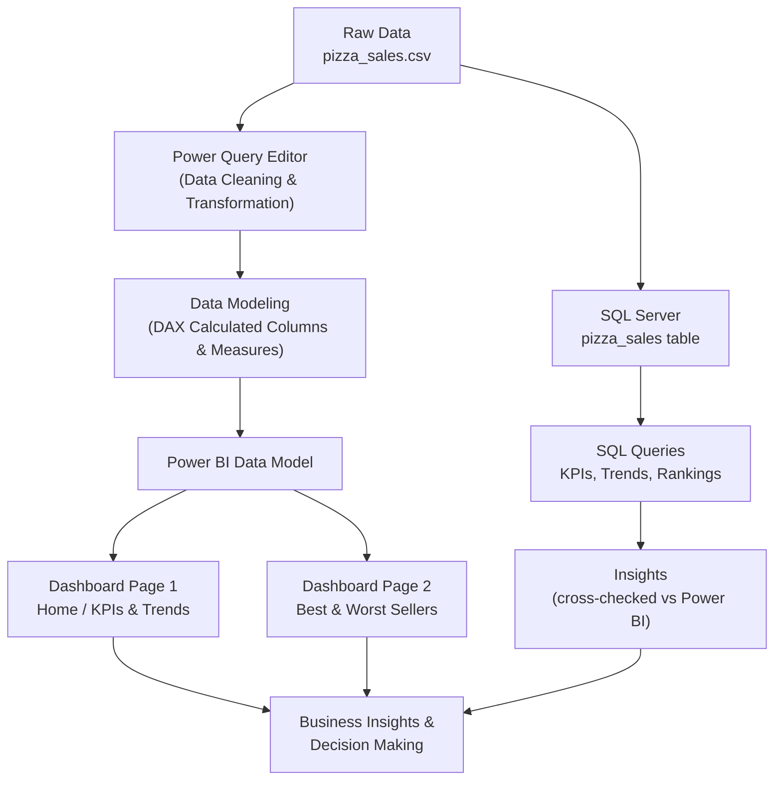
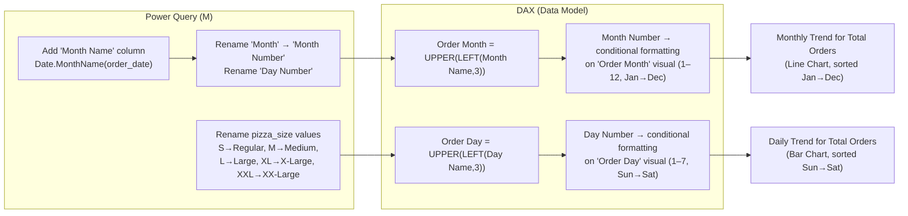
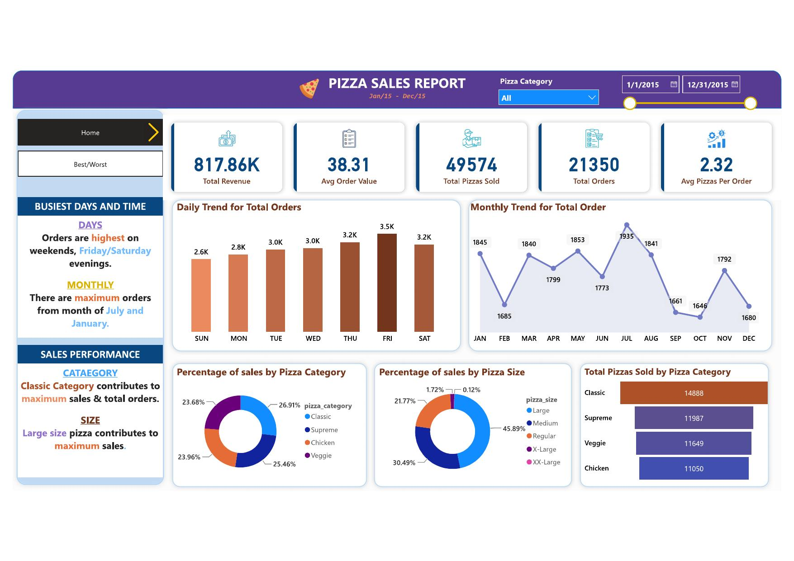
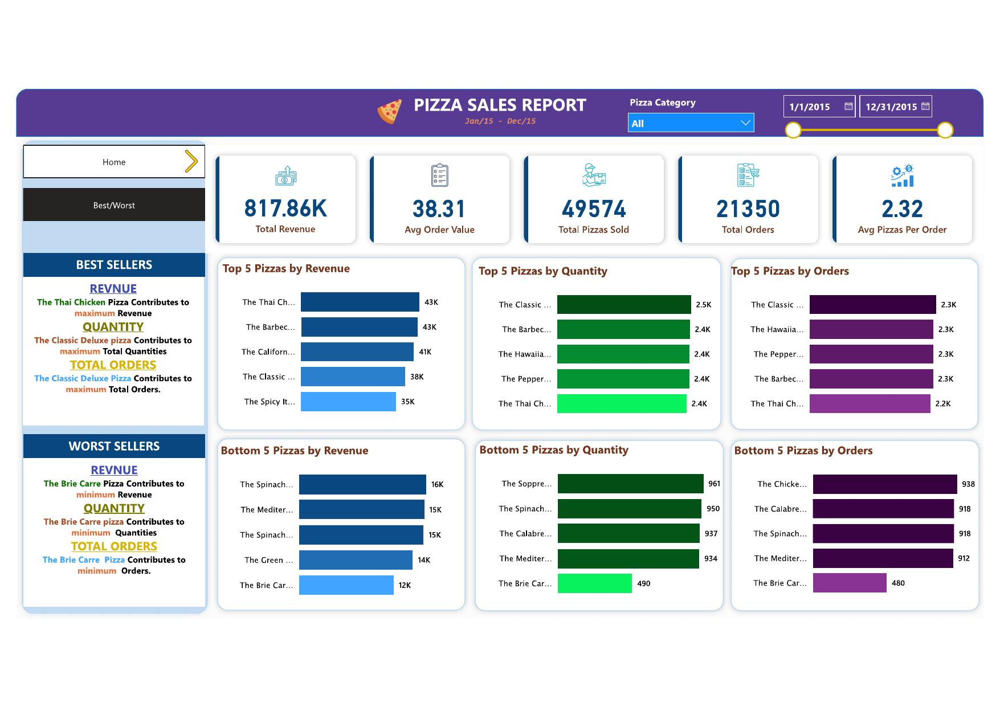

# 🍕 Pizza Sales Analysis — Power BI Dashboard & SQL Analysis

An end-to-end data analytics project that cleans, models, and visualizes a full year (2015) of pizza sales transactions using **Power Query, DAX, and Power BI**, backed by an equivalent set of **SQL** queries for the same KPIs and insights.

---

## 📌 Table of Contents

- [Overview](#-overview)
- [Problem Statement](#-problem-statement)
- [Dataset](#-dataset)
- [Tech Stack](#-tech-stack)
- [Project Workflow](#-project-workflow)
- [Data Cleaning & Transformation](#-data-cleaning--transformation)
- [DAX Measures](#-dax-measures)
- [SQL Analysis](#-sql-analysis)
- [Dashboard](#-dashboard)
- [Key Insights](#-key-insights)
- [Repository Structure](#-repository-structure)
- [How to Use](#-how-to-use)
- [Author](#-author)

---

## 📖 Overview

A pizza restaurant chain wants to understand its **2015 sales performance** — revenue trends, order patterns, best/worst performing products, and customer size/category preferences — in order to make data-driven decisions on menu, staffing, and promotions.

This project takes raw order-level transaction data and turns it into:
1. A cleaned & modeled dataset (Power Query + DAX)
2. An interactive **Power BI dashboard** with KPIs and 7 charts
3. A parallel **SQL** analysis reproducing the same KPIs/insights for anyone working outside Power BI

---

## 🎯 Problem Statement

### KPI Requirements

We need to analyze key indicators for the pizza sales data to gain insight into business performance:

| # | KPI | Definition |
|---|-----|------------|
| 1 | **Total Revenue** | Sum of the total price of all pizza orders |
| 2 | **Average Order Value** | Total revenue ÷ total number of orders |
| 3 | **Total Pizzas Sold** | Sum of the quantities of all pizzas sold |
| 4 | **Total Orders** | Total number of orders placed |
| 5 | **Average Pizzas Per Order** | Total pizzas sold ÷ total number of orders |

### Chart Requirements

| # | Chart | Type | Purpose |
|---|-------|------|---------|
| 1 | Daily Trend for Total Orders | Bar chart | Identify order patterns/fluctuations by day of week |
| 2 | Monthly Trend for Total Orders | Line chart | Identify peak months/seasonality |
| 3 | % of Sales by Pizza Category | Pie/Donut chart | Popularity of each category's contribution to sales |
| 4 | % of Sales by Pizza Size | Pie/Donut chart | Customer size preference and its impact on sales |
| 5 | Total Pizzas Sold by Pizza Category | Funnel/Bar chart | Compare sales performance across categories |
| 6 | Top 5 Best Sellers | Bar chart | Best pizzas by Revenue, Quantity, and Orders |
| 7 | Bottom 5 Worst Sellers | Bar chart | Underperforming pizzas by Revenue, Quantity, and Orders |

---

## 🗂 Dataset

Source file: [`pizza_sales.csv`](pizza_sales.csv)

| Column | Description |
|---|---|
| `pizza_id` | Unique row/line-item ID |
| `order_id` | Order identifier (one order can contain multiple pizzas) |
| `pizza_name_id` | SKU-style pizza identifier |
| `quantity` | Number of that pizza ordered in the line item |
| `order_date` | Date of the order (Jan 2015 – Dec 2015) |
| `order_time` | Time of the order |
| `unit_price` | Price per pizza |
| `total_price` | `unit_price × quantity` |
| `pizza_size` | S, M, L, XL, XXL |
| `pizza_category` | Classic, Chicken, Supreme, Veggie |
| `pizza_ingredients` | List of ingredients |
| `pizza_name` | Full pizza name |

**~48,620** line items across **21,350** distinct orders for the full year of 2015.

---

## 🛠 Tech Stack

- **Power BI Desktop** — dashboard & data visualization
- **Power Query (M language)** — data cleaning & transformation
- **DAX** — calculated columns & measures
- **SQL Server (T-SQL)** — parallel/backend analytical queries
- **GitHub** — version control & documentation

---

## 🔄 Project Workflow



### Transformation & Modeling Flow



---

## 🧹 Data Cleaning & Transformation

### 1. Standardizing Pizza Size labels
The raw size codes were remapped to readable labels for the dashboard:

| Raw value | Mapped value |
|---|---|
| `S` | Regular |
| `M` | Medium |
| `L` | Large |
| `XL` | X-Large |
| `XXL` | XX-Large |

### 2. Day of Week extraction (for the Daily Trend chart)

Steps:
1. In **Power Query**, `order_date` is used to derive the day of week (`Day Name`) and its numeric order (`Day Number`).
2. A DAX calculated column shortens/uppercases the day name for compact axis labels:

```dax
Order Day = UPPER(LEFT(pizza_sales[Day Name], 3))
```

3. The **`Day Number`** column (1 = Sunday … 7 = Saturday) is applied as **"Sort by Column"** on `Order Day`, so the *Daily Trend for Total Orders* bar chart always renders **Sunday → Saturday**, regardless of default alphabetical sorting.

### 3. Month extraction (for the Monthly Trend chart)

Steps in **Power Query**:

```m
= Table.AddColumn(#"Filtered Rows", "Month Name", each Date.MonthName([order_date]), type text)
```

```m
= Table.RenameColumns(#"Inserted Month", {{"Month", "Month Number"}, {"Day NUmber", "Day Number"}})
```

Then in **DAX**, the month name is shortened/uppercased:

```dax
Order Month = UPPER(LEFT(pizza_sales[Month Name], 3))
```

The **`Month Number`** column (1 = Jan … 12 = Dec) is applied as **"Sort by Column"** on `Order Month`, so the *Monthly Trend for Total Orders* line chart always renders in true calendar order **Jan → Dec**.

---

## 📐 DAX Measures

```dax
Total Revenue = SUM(pizza_sales[total_price])

Average Order Value = DIVIDE([Total Revenue], [Total Orders])

Total Pizzas Sold = SUM(pizza_sales[quantity])

Total Orders = DISTINCTCOUNT(pizza_sales[order_id])

Average Pizzas Per Order = DIVIDE([Total Pizzas Sold], [Total Orders])

Order Day = UPPER(LEFT(pizza_sales[Day Name], 3))

Order Month = UPPER(LEFT(pizza_sales[Month Name], 3))
```

> `Order Day` and `Order Month` are sorted using their corresponding `Day Number` / `Month Number` columns via **Column tool → Sort by Column** in Power BI, which is how the Daily/Monthly Trend charts keep their natural chronological order.

---

## 🗃 SQL Analysis

All KPI, trend, and ranking queries were replicated in T-SQL against a `pizza_sales` table — see the full script here: [`pizza_sales_queries.sql`](pizza_sales_queries.sql)

**Highlights:**

```sql
-- Total Revenue
SELECT SUM(total_price) AS Total_Revenue FROM pizza_sales;

-- Average Order Value
SELECT (SUM(total_price) / COUNT(DISTINCT order_id)) AS Avg_Order_Value FROM pizza_sales;

-- Daily Trend for Total Orders
SELECT DATENAME(DW, order_date) AS order_day, COUNT(DISTINCT order_id) AS total_orders
FROM pizza_sales
GROUP BY DATENAME(DW, order_date);

-- Monthly Trend for Orders
SELECT DATENAME(MONTH, order_date) AS Month_Name, COUNT(DISTINCT order_id) AS Total_Orders
FROM pizza_sales
GROUP BY DATENAME(MONTH, order_date);

-- Top 5 Pizzas by Revenue
SELECT TOP 5 pizza_name, SUM(total_price) AS Total_Revenue
FROM pizza_sales
GROUP BY pizza_name
ORDER BY Total_Revenue DESC;
```

The full script also covers: % of Sales by Category/Size, Total Pizzas Sold by Category, Top/Bottom 5 by Revenue/Quantity/Orders, and an example of filtering any query by `pizza_category` or `pizza_size` using a `WHERE` clause.

---

## 📊 Dashboard

### Page 1 — Home (KPIs & Trends)


- KPI cards: Total Revenue, Avg Order Value, Total Pizzas Sold, Total Orders, Avg Pizzas Per Order
- Daily Trend for Total Orders (Sun → Sat)
- Monthly Trend for Total Orders (Jan → Dec)
- % of Sales by Pizza Category
- % of Sales by Pizza Size
- Total Pizzas Sold by Pizza Category

### Page 2 — Best & Worst Sellers


- Top 5 / Bottom 5 Pizzas by Revenue
- Top 5 / Bottom 5 Pizzas by Quantity
- Top 5 / Bottom 5 Pizzas by Orders

---

## 💡 Key Insights

- **Total Revenue** for 2015: **$817.86K** across **21,350 orders** (49,574 pizzas sold)
- **Average Order Value**: **$38.31**, with an average of **2.32 pizzas per order**
- **Busiest days**: Orders peak on **weekends**, especially **Friday/Saturday** evenings
- **Busiest months**: **July** and **January** see the highest order volumes
- **Category performance**: The **Classic** category drives the most sales and total orders
- **Size preference**: **Large** pizzas contribute the most to overall sales
- **Best seller**: *The Thai Chicken Pizza* leads by revenue; *The Classic Deluxe Pizza* leads by quantity and total orders
- **Worst seller**: *The Brie Carre Pizza* is the lowest performer across revenue, quantity, and orders

---

## 📁 Repository Structure

```
pizza-sales-analysis/
│
├── README.md                          # Project documentation (this file)
├── data/
│   └── pizza_sales.csv                # Raw dataset
├── sql/
│   └── pizza_sales_queries.sql        # All SQL KPI & analysis queries
├── powerbi/
│   └── pizza_sales_dashboard.pbix     # Power BI report file
└── screenshots/
    ├── dashboard_home.png             # Dashboard page 1
    └── dashboard_best_worst.png       # Dashboard page 2
```

---

## 🚀 How to Use

1. Clone the repository:
   ```bash
   git clone https://github.com/<your-username>/pizza-sales-analysis.git
   ```
2. **Power BI**: open `powerbi/pizza_sales_dashboard.pbix` in Power BI Desktop to explore the interactive dashboard.
3. **SQL**: run `sql/pizza_sales_queries.sql` against a SQL Server instance with the `pizza_sales.csv` data loaded into a table named `pizza_sales`.
4. **Data**: the raw dataset is available at `data/pizza_sales.csv`.

---

## 👤 Author

**Nabamit Dutta**
📊 [Kaggle Profile](https://www.kaggle.com/nabamitdutta)

If you find this project useful, consider giving the repo a ⭐!
