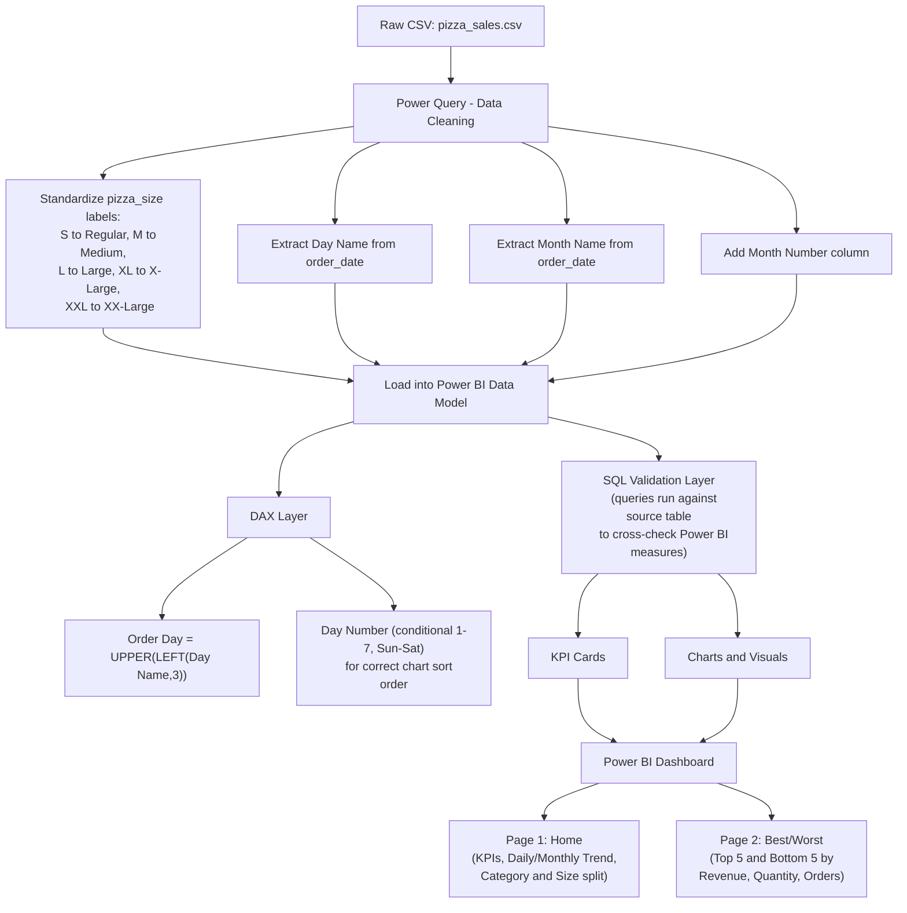

# 🍕 Pizza Sales Analysis — Power BI Dashboard

An end-to-end data analytics project that cleans, models, and visualizes a year of pizza sales transactions (Jan–Dec 2015) to surface revenue trends, best/worst sellers, and ordering patterns for a pizza restaurant chain.


---

## 📌 Problem Statement

The business wants to understand its pizza sales performance and needs two things:

### A. KPI Requirements
| # | KPI | Definition |
|---|-----|------------|
| 1 | **Total Revenue** | Sum of the total price of all pizza orders |
| 2 | **Average Order Value** | Total revenue ÷ total number of orders |
| 3 | **Total Pizzas Sold** | Sum of quantities across all orders |
| 4 | **Total Orders** | Count of distinct orders placed |
| 5 | **Average Pizzas Per Order** | Total pizzas sold ÷ total number of orders |

### B. Chart Requirements
| # | Chart | Type | Purpose |
|---|-------|------|---------|
| 1 | Daily Trend for Total Orders | Bar chart | Spot order-volume patterns across days of the week |
| 2 | Monthly Trend for Total Orders | Line chart | Spot seasonal / monthly peaks |
| 3 | % of Sales by Pizza Category | Donut chart | Compare category popularity |
| 4 | % of Sales by Pizza Size | Donut chart | Understand size preference |
| 5 | Total Pizzas Sold by Pizza Category | Bar chart | Compare category-level volume |
| 6 | Top 5 Best Sellers | Bar chart | By Revenue, Quantity, and Orders |
| 7 | Bottom 5 Worst Sellers | Bar chart | By Revenue, Quantity, and Orders |

---

## 🗺️ Project Workflow



---

## 🧹 Data Cleaning & Transformation

### 1. Pizza Size Standardization
Raw abbreviations were mapped to readable labels for cleaner visuals and slicers:

| Raw Value | Cleaned Value |
|-----------|---------------|
| S | Regular |
| M | Medium |
| L | Large |
| XL | X-Large |
| XXL | XX-Large |

### 2. Date Feature Extraction (Power Query)

**Extract Month Name** from `order_date`:
```m
= Table.AddColumn(#"Filtered Rows", "Month Name", each Date.MonthName([order_date]), type text)
```

**Rename to get Month Number / Day Number** (clean, consistent column names):
```m
= Table.RenameColumns(#"Inserted Month", {{"Month", "Month Number"}, {"Day NUmber", "Day Number"}})
```

### 3. DAX Calculated Columns (Data Model)

**Order Day** — a short, uppercase day label (e.g. `SUN`, `MON`) used to label the Daily Trend bar chart:
```dax
Order Day = UPPER(LEFT(pizza_sales[Day Name], 3))
```

**Day Number** — a conditional numeric column (1–7) mapping Sunday → Saturday, so the Daily Trend chart plots in correct calendar order instead of alphabetical order:
```dax
Day Number =
SWITCH(
    pizza_sales[Order Day],
    "SUN", 1,
    "MON", 2,
    "TUE", 3,
    "WED", 4,
    "THU", 5,
    "FRI", 6,
    "SAT", 7
)
```
This column is used to **sort the `Order Day` column** (`Column tools → Sort by column → Day Number`), which fixes the default alphabetical sort Power BI applies to text axes.

---

## 🗄️ SQL Queries

All KPIs and chart datasets were validated in SQL Server against the `pizza_sales` table before being replicated as Power BI measures/visuals.

### A. KPIs

**1. Total Revenue**
```sql
SELECT SUM(total_price) AS Total_Revenue
FROM pizza_sales;
```

**2. Average Order Value**
```sql
SELECT (SUM(total_price) / COUNT(DISTINCT order_id)) AS Avg_order_Value
FROM pizza_sales;
```

**3. Total Pizzas Sold**
```sql
SELECT SUM(quantity) AS Total_pizza_sold
FROM pizza_sales;
```

**4. Total Orders**
```sql
SELECT COUNT(DISTINCT order_id) AS Total_Orders
FROM pizza_sales;
```

**5. Average Pizzas Per Order**
```sql
SELECT CAST(
        CAST(SUM(quantity) AS DECIMAL(10,2)) /
        CAST(COUNT(DISTINCT order_id) AS DECIMAL(10,2))
       AS DECIMAL(10,2)) AS Avg_Pizzas_per_order
FROM pizza_sales;
```

### B. Daily Trend for Total Orders
```sql
SELECT DATENAME(DW, order_date) AS order_day, COUNT(DISTINCT order_id) AS total_orders
FROM pizza_sales
GROUP BY DATENAME(DW, order_date);
```

### C. Monthly Trend for Orders
```sql
SELECT DATENAME(MONTH, order_date) AS Month_Name, COUNT(DISTINCT order_id) AS Total_Orders
FROM pizza_sales
GROUP BY DATENAME(MONTH, order_date);
```

### D. % of Sales by Pizza Category
```sql
SELECT pizza_category,
       CAST(SUM(total_price) AS DECIMAL(10,2)) AS total_revenue,
       CAST(SUM(total_price) * 100 / (SELECT SUM(total_price) FROM pizza_sales) AS DECIMAL(10,2)) AS PCT
FROM pizza_sales
GROUP BY pizza_category;
```

### E. % of Sales by Pizza Size
```sql
SELECT pizza_size,
       CAST(SUM(total_price) AS DECIMAL(10,2)) AS total_revenue,
       CAST(SUM(total_price) * 100 / (SELECT SUM(total_price) FROM pizza_sales) AS DECIMAL(10,2)) AS PCT
FROM pizza_sales
GROUP BY pizza_size
ORDER BY pizza_size;
```

### F. Total Pizzas Sold by Pizza Category (example filtered to February)
```sql
SELECT pizza_category, SUM(quantity) AS Total_Quantity_Sold
FROM pizza_sales
WHERE MONTH(order_date) = 2
GROUP BY pizza_category
ORDER BY Total_Quantity_Sold DESC;
```

### G. Top 5 Pizzas by Revenue
```sql
SELECT TOP 5 pizza_name, SUM(total_price) AS Total_Revenue
FROM pizza_sales
GROUP BY pizza_name
ORDER BY Total_Revenue DESC;
```

### H. Bottom 5 Pizzas by Revenue
```sql
SELECT TOP 5 pizza_name, SUM(total_price) AS Total_Revenue
FROM pizza_sales
GROUP BY pizza_name
ORDER BY Total_Revenue ASC;
```

### I. Top 5 Pizzas by Quantity
```sql
SELECT TOP 5 pizza_name, SUM(quantity) AS Total_Pizza_Sold
FROM pizza_sales
GROUP BY pizza_name
ORDER BY Total_Pizza_Sold DESC;
```

### J. Bottom 5 Pizzas by Quantity
```sql
SELECT TOP 5 pizza_name, SUM(quantity) AS Total_Pizza_Sold
FROM pizza_sales
GROUP BY pizza_name
ORDER BY Total_Pizza_Sold ASC;
```

### K. Top 5 Pizzas by Total Orders
```sql
SELECT TOP 5 pizza_name, COUNT(DISTINCT order_id) AS Total_Orders
FROM pizza_sales
GROUP BY pizza_name
ORDER BY Total_Orders DESC;
```

### L. Bottom 5 Pizzas by Total Orders
```sql
SELECT TOP 5 pizza_name, COUNT(DISTINCT order_id) AS Total_Orders
FROM pizza_sales
GROUP BY pizza_name
ORDER BY Total_Orders ASC;
```

### Note — Filtering by Category or Size
Any of the above queries can be filtered with a `WHERE` clause, e.g.:
```sql
SELECT TOP 5 pizza_name, COUNT(DISTINCT order_id) AS Total_Orders
FROM pizza_sales
WHERE pizza_category = 'Classic'
GROUP BY pizza_name
ORDER BY Total_Orders ASC;
```

---

## 📊 Dashboard Pages

### 1. Home
- KPI cards: Total Revenue, Avg Order Value, Total Pizzas Sold, Total Orders, Avg Pizzas Per Order
- Daily Trend for Total Orders (bar) — orders peak on **Friday/Saturday**
- Monthly Trend for Total Orders (line) — peaks in **July and January**
- % of Sales by Pizza Category (donut) — **Classic** leads
- % of Sales by Pizza Size (donut) — **Large** leads
- Total Pizzas Sold by Pizza Category (bar)

### 2. Best / Worst
- Top 5 & Bottom 5 Pizzas by Revenue
- Top 5 & Bottom 5 Pizzas by Quantity
- Top 5 & Bottom 5 Pizzas by Total Orders

---

## 🔑 Key Insights

- **Total Revenue:** $817.86K across **21,350 orders** and **49,574 pizzas sold**
- **Avg Order Value:** $38.31 | **Avg Pizzas per Order:** 2.32
- Orders peak on **Friday and Saturday evenings**; slowest around **weekday off-peak hours**
- **July** and **January** are the highest-volume months
- **Classic** category and **Large** size drive the most sales
- **The Thai Chicken Pizza** and **The Barbecue Chicken Pizza** are top revenue drivers
- **The Brie Carre Pizza** is consistently the weakest performer across revenue, quantity, and orders

---

## 🧰 Tech Stack

- **Power BI** — data modeling, DAX, dashboard design
- **Power Query (M)** — data cleaning & transformation
- **SQL Server** — query validation / exploratory analysis
- **DAX** — calculated columns for day/date logic

---

## 📁 Repository Structure

```
pizza-sales-dashboard/
├── README.md
├── data/
│   └── pizza_sales.csv
├── sql/
│   └── pizza_sales_queries.sql
├── powerbi/
│   └── Pizza_Sales_Dashboard.pbix
└── assets/
    ├── dashboard-home.jpg
    └── dashboard-best-worst.jpg
```

---

## 🚀 How to Use

1. Clone the repo
   ```bash
   git clone https://github.com/<your-username>/pizza-sales-dashboard.git
   ```
2. Open `powerbi/Pizza_Sales_Dashboard.pbix` in Power BI Desktop
3. Refresh the data source to point at `data/pizza_sales.csv` if needed
4. Explore the SQL validation queries in `sql/pizza_sales_queries.sql`

---

## 📎 Open Issues / Future Improvements

- Add a funnel chart for Total Pizzas Sold by Pizza Category (per original chart requirement)
- Add drill-through from category/size visuals to pizza-level detail
- Parameterize the SQL queries for reusable category/size filtering
- Add YoY comparison once more years of data are available

---

## 👤 Author

**Nabamit Dutta**
[Kaggle Profile](https://www.kaggle.com/nabamitdutta)
